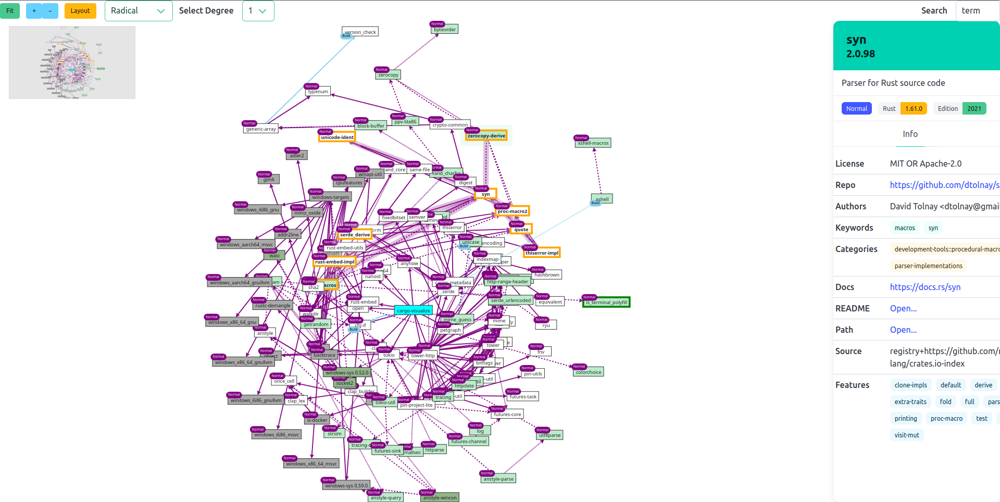

# cargo-visualize

Know your dependencies via interactive cargo dependency graph visualization.

An opinionated fork of [cargo-depgraph](https://github.com/jplatte/cargo-depgraph)
that focuses on interactivity.

> 🚧 **Under Development** 🚧
>
> `cargo-visualize` is still under heavy development.
> Missing features and frictions with the UI interface are expected.
> You are welcome to submit pull requests to make `cargo-visualize` better!

## Installation

See [installation instructions](./INSTALL.md)

## Usage

`cargo visualize [options]`

The full list of options can be seen by running

`cargo visualize --help`

Commonly useful options:

* `--all-deps`
* `--all-deps --dedup-transitive-deps`

## Output explanation

* Cyan background = root / workspace member
* Grey background = target-specific dependency
* Green background = optional dependency
* Dark Green background = optional target-specific dependency
* Dotted lines = optional dependency (could be removed by disabling a cargo feature)
* Dashed lines = transitively optional dependency (could be removed by removing one of the dotted edges)

## Advanced Usage

The [G6 Graph engine](https://g6.antv.antgroup.com/) is exposed as a global variable.
You can interact with the `graph` variable directly in F12 Developer Console.
However, we make no promise about the stability of this interface.
